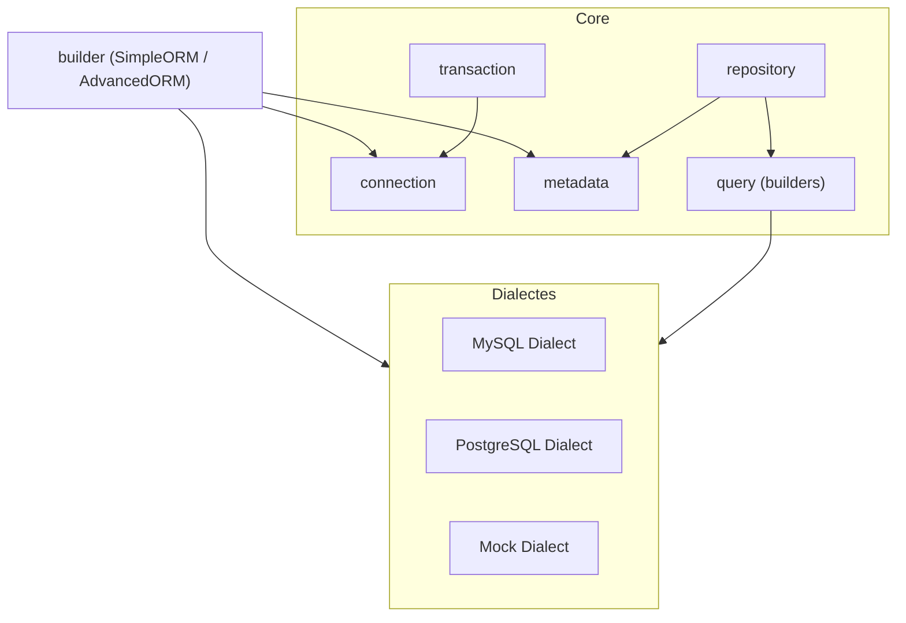

# Architecture générale

Cette page décrit la structure interne de GO ORM et la façon dont les packages interagissent.

## Fonctionnalités Go utilisées

### Packages standards
* `database/sql` : Interface standard de Go pour les bases de données SQL
* `reflect` : Utilisé pour l'introspection des structures et l'extraction des métadonnées
* `sync` : Gestion du cache de métadonnées thread-safe avec `sync.Map`
* `context` : Support des contextes pour les opérations de base de données
* `errors` : Gestion avancée des erreurs avec `errors.Is` et `errors.As`

### Concepts Go avancés
* **Interfaces** : Découplage fort via des interfaces comme `Dialect`, `Repository`, `QueryBuilder`
* **Generics** : Utilisés dans le Repository pour un typage fort (`Repository[T]`)
* **Composition** : Les structures embarquent d'autres structures pour la réutilisation
* **Méthodes pointeur/valeur** : Choix stratégique selon les besoins de mutation
* **init()** : Initialisation des dialectes et enregistrement dans la factory
* **defer** : Gestion propre des ressources (connexions, transactions)

### Patterns Go idiomatiques
* **Builder pattern** : Configuration fluide de l'ORM
* **Factory method** : Création des dialectes
* **Options pattern** : Configuration flexible via des fonctions options
* **Error wrapping** : Enrichissement du contexte des erreurs
* **Middleware pattern** : Pour les hooks et les transactions

## Découpage des packages

| Package | Rôle | Dépendances principales |
|---------|------|-------------------------|
| `orm/builder` | Crée et configure l'ORM (pattern Builder) | `orm/core/*`, `orm/dialect`, `orm/factory` |
| `orm/core/connection` | Gère la connexion DB, pooling | `orm/dialect` |
| `orm/core/metadata` | Extrait les métadonnées via réflexion, met en cache | `reflect` |
| `orm/core/query` | Implemente le Query Builder | `orm/dialect`, `gorm/core/metadata` |
| `orm/core/repository` | Fournit le CRUD, scopes, hooks | `orm/core/query`, `orm/core/metadata` |
| `orm/core/transaction` | Encapsule les transactions | `orm/core/connection` |
| `orm/dialect` | Définit l'interface Dialect ; implémentations MySQL/PostgreSQL/Mock | `database/sql` |
| `orm/factory` | Fabrique de dialectes | `orm/dialect` |

## Flux de connexion

1. `SimpleORM` appelle **builder.Connect()**.  
2. Le Builder crée une **Connection** avec le Dialect choisi.  
3. Le Dialect ouvre un `*sql.DB` et configure le pool.  
4. Les **Metadata** sont extraites et mises en cache.  
5. Les tables sont créées/migrées si `WithAutoCreateDatabase` est activé.

## Stratégies de conception

* **Inversion de dépendance** : les couches haut-niveau (Repository) dépendent d'interfaces (QueryBuilder, Dialect) plutôt que d'implémentations.
* **Réflexion contrôlée** : uniquement lors de l'extraction des métadonnées, résultat mis en cache pour éviter les surcoûts.
* **Chaînage fluide** : toutes les méthodes Builder retournent le receveur pour simplifier la configuration.

---

> Pour plus de détails sur chaque Dialecte, voir la page suivante. 